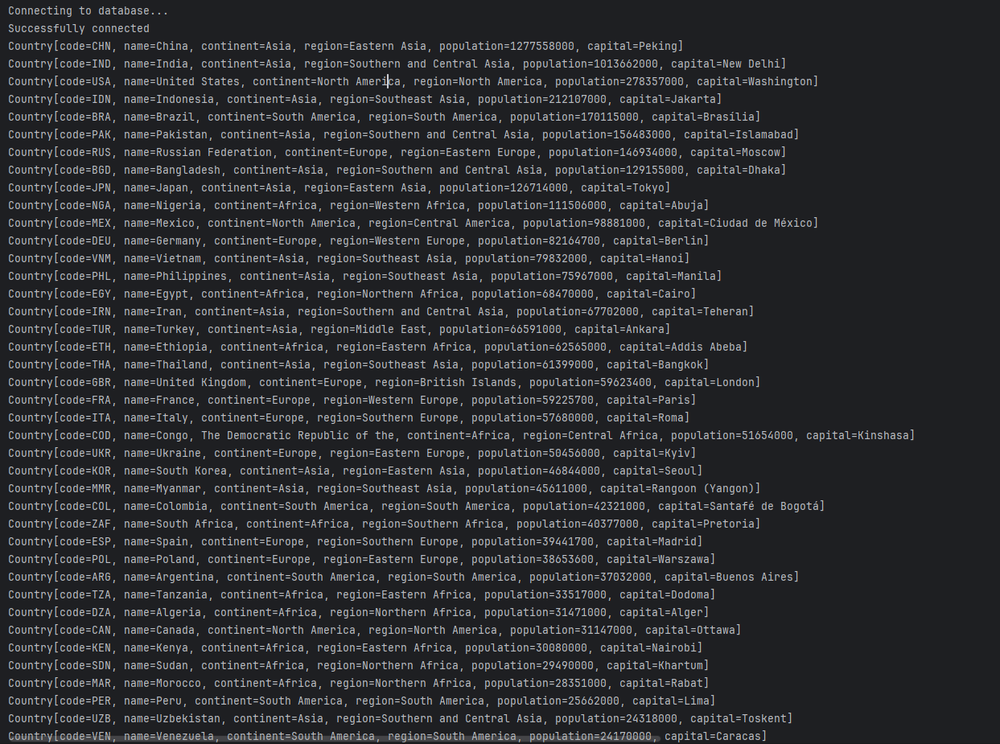
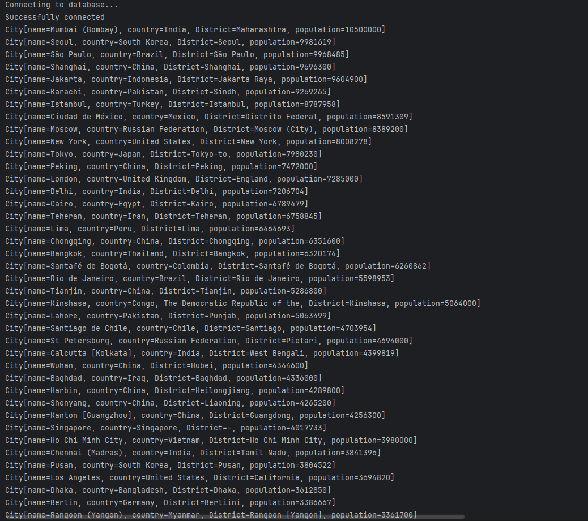
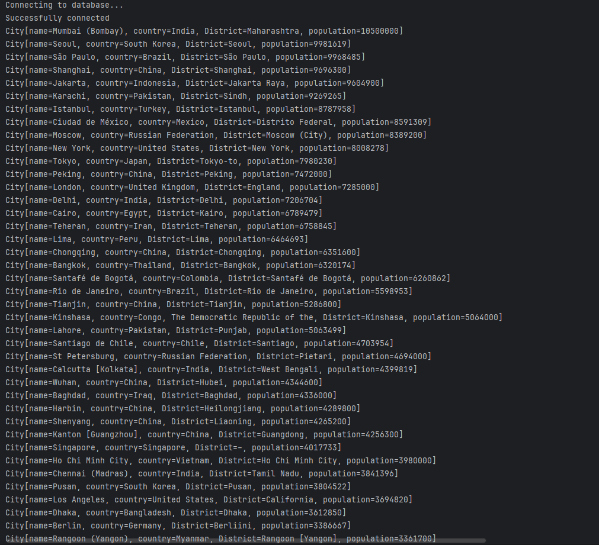
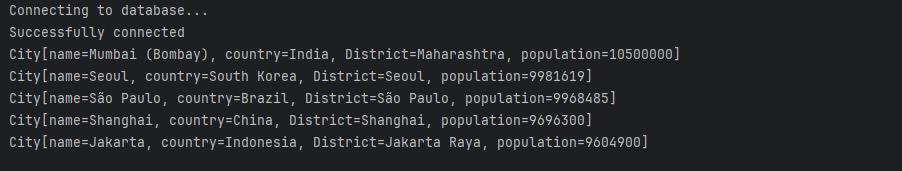
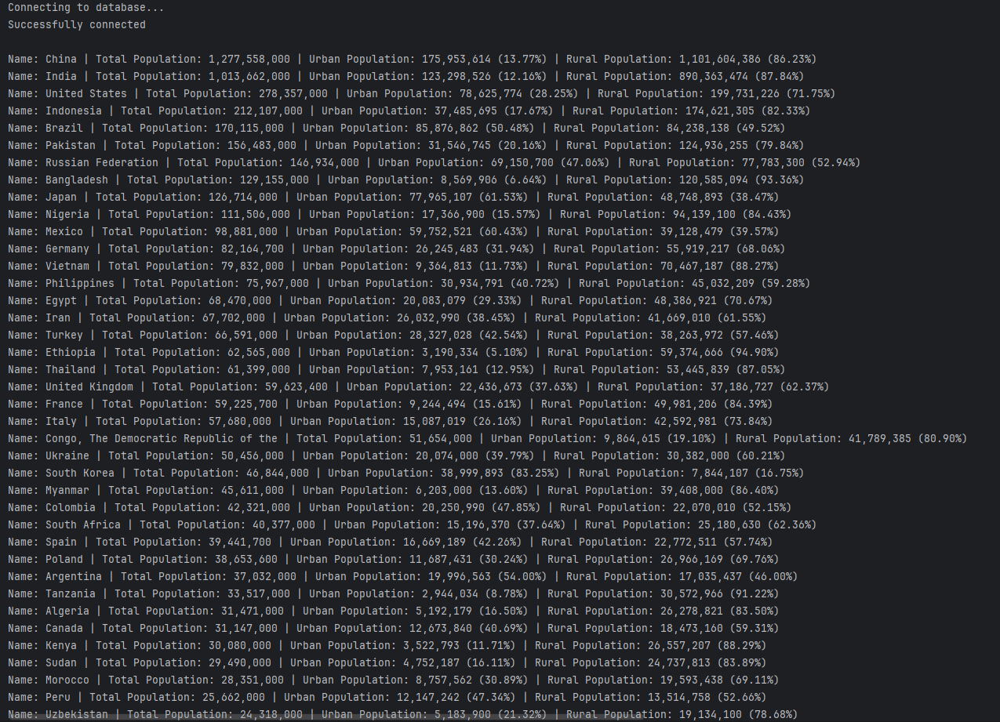
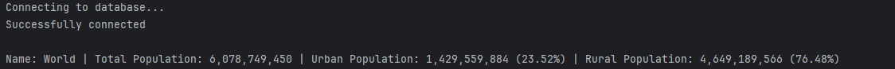
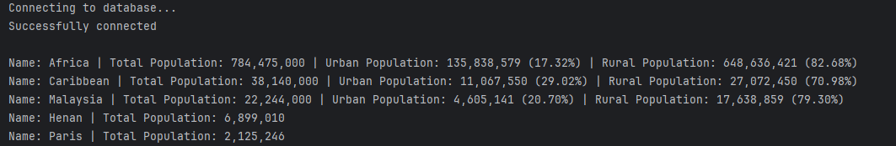
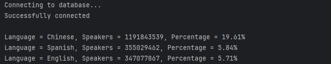

Coursework for Software Engineering Methods

Master Build Status:    
Develop Build Status:    

 
 

8 requirements of 8 have been implemented; 100%.

<table>
  <thead>
    <tr>
      <th>ID</th>
      <th>Name</th>
      <th>Met</th>
      <th>Screenshot</th>
    </tr>
  </thead>
  <tbody>
    <tr>
      <td>1</td>
      <td>All the countries in the world organised by largest population to smallest.</td>
      <td>Yes</td>
      <td>
        
      </td>
    </tr>
    <tr>
      <td>2</td>
      <td>All the cities in the world organised by largest population to smallest.</td>
      <td>Yes</td>
      <td>
        
      </td>
    </tr>
    <tr>
      <td>3</td>
      <td>All the capital cities in the world organised by largest population to smallest.</td>
      <td>Yes</td>
      <td>
        
      </td>
    </tr>
    <tr>
      <td>4</td>
      <td>The top N populated cities in the world where N is provided by the user.</td>
      <td>Yes</td>
      <td>
        
      </td>
    </tr>
    <tr>
      <td>5</td>
      <td>The population of people, people living in cities, and people not living in cities in each country.</td>
      <td>Yes</td>
      <td>
        
      </td>
    </tr>
    <tr>
      <td>6</td>
      <td>The population of the world</td>
      <td>Yes</td>
      <td>
        
      </td>
    </tr>
    <tr>
      <td>7</td>
      <td>The population of a continent, a region, a country, a district, and a city</td>
      <td>Yes</td>
      <td>
        
      </td>
    </tr>
    <tr>
      <td>8</td>
      <td>The number of people who speak Chinese, English and Spanish from greatest number to smallest,
        including the percentage of the world population</td>
      <td>Yes</td>
      <td>
        
      </td>
    </tr>
  </tbody>
</table>